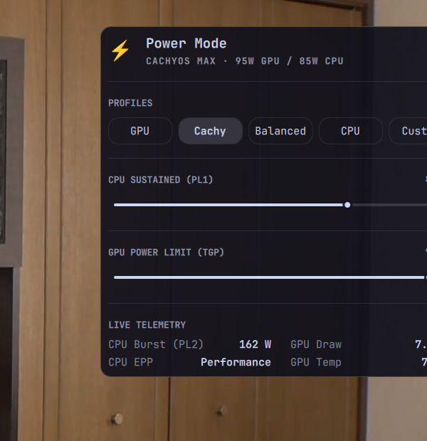

# ⚡ power-mode

[](LICENSE)
[]()
[-brightgreen.svg)]()
[]()

> **Universal Linux Dynamic CPU/GPU Power Profiler, Package Power Orchestrator & Telemetry Manager.**

<p align="center">
  
</p>

---

`power-mode` is a lightweight, zero-dependency Linux tool that synchronously controls **Intel RAPL (PL1/PL2) sustained wattages**, **CPU Energy Performance Preferences (EPP)**, **ACPI Platform Profiles**, and **NVIDIA Discrete GPU TGP** from a unified Terminal UI (TUI), CLI, or desktop top-bar widget.

---

## 🎯 Why This Tool Exists & Who Needs It

### 🔍 The Core Problem: Shared Laptop Cooling & Total Power Limits
In modern laptops (especially gaming and mobile workstation laptops), the **CPU and GPU share the same copper heat pipes, vapor chamber, and exhaust fin arrays**. Furthermore, laptops operate under a strict **Total Power Budget** constrained by the AC power adapter (e.g., 170W – 230W) and internal VRM thermal limits.

When both the CPU and GPU attempt to boost simultaneously under demanding tasks:
1. **Thermal Cross-Talk**: Heat from an aggressively boosting CPU saturates the shared heat pipes, heating up the GPU (and vice versa).
2. **Thermal Throttling**: Both chips hit their 95°C–100°C thermal ceilings and aggressively downclock, resulting in frame stutter, dropped clock speeds, and loud fan noise.
3. **Power Starvation**: The CPU may draw 85W+ on minor background threads while the GPU is starved of electrical wattage, dropping GPU graphics performance.

---

### 💡 The Solution: Active Thermal & Electrical Budget Balancing
By **actively regulating and capping the power draw of the idle or less-critical component**, you free up both **electrical wattage** and **thermal cooling headroom** for the component that actually needs it:

* 🎮 **Gaming & 3D Rendering (GPU-Bound)**:
  * By constraining the CPU from 85W down to 35W (which is plenty for games), CPU temperature drops by **15°C–25°C**.
  * This newly freed cooling capacity allows the **NVIDIA GPU to sustain its maximum 95W–140W Dynamic Boost clock** without thermal throttling or frame drops.
* ⚙️ **Code Compilation, Physics & Data Science (CPU-Bound)**:
  * By capping the GPU to 30W–40W, the laptop can deliver **85W–115W sustained all-core Turbo Boost** to the CPU, drastically cutting compilation and computation times.
* 🔋 **On Battery / Light Workloads**:
  * Capping both silicon chips to low power envelopes eliminates background spikes, ensures near-silent fans, and doubles battery life.

---

### 👥 Who Is This For?
* **Laptop Gamers & 3D Artists**: Stop CPU thermal throttling from killing GPU frame rates in heavy 3D games and Unreal/Blender rendering.
* **Software Developers & Engineers**: Maximize sustained multi-core CPU compilation performance (Rust, C++, Linux kernel builds) without heat saturation.
* **Machine Learning & Data Practitioners**: Run local LLM inference or CPU training on laptops with consistent, un-throttled thermal stability.
* **Linux Laptop Power Users**: Anyone who wants fine-grained, on-the-fly control over their hardware without depending on bloated proprietary OEM software.

---

## 🌟 Key Features

* **🔬 Zero Dependencies**: Built entirely using Python's standard library (`curses`, `sysfs`, `subprocess`). Runs out of the box on any Linux distribution (Arch, Fedora, Ubuntu, Debian, CachyOS, Void, NixOS).
* **🧠 Adaptive Hardware Probing**:
  * **GPU Detected**: Generates specialized high-performance GPU profiles (`GPU Max`, `Balanced`, `CPU Compute`, `Eco`).
  * **No GPU (Integrated / Headless / CPU Machines)**: Automatically detects GPU absence and generates **CPU ML Training / High-Compute Modes** (uncapped sustained PL1/PL2, performance governor, all cores max boost).
  * **CachyOS Kernel Detection**: Detects CachyOS kernels (`BORE`/`EEVDF` schedulers) and generates ultra-low-latency high-throughput scheduler profiles.
* **🎮 Simulation / Dry-Run Mode (`--simulate` / `--dry-run`)**:
  * Test hardware detection, probe RAPL limits, and preview profile adjustments without requiring root permissions or altering system state.
* **⚙️ Interactive Custom Tuner**:
  * Live `$ \leftarrow / \rightarrow $` wattage sliders in 5W increments to dial in exact CPU sustained (PL1) and GPU TGP limits.
* **🖥️ Desktop Widget Extensions**:
  * Includes ready-to-use plugins for **Omarchy / Quickshell** popup panels and **Waybar**.

---

## 📋 Profile Matrix

### 1. Devices with Dedicated NVIDIA GPU
| Profile | CPU PL1 (Sustained) | CPU PL2 (Burst) | GPU Power Limit (TGP) | CPU Governor (EPP) | ACPI Profile | Target Workload |
| :--- | :---: | :---: | :---: | :---: | :---: | :--- |
| **GPU** | 35 W | 55 W | **95 W (MAX)** | `performance` | `performance` | **AAA Gaming & GPU ML Training** (Keeps CPU cool so GPU boosts to maximum) |
| **CACHYOS** *(if detected)* | 85 W | 162 W | **95 W (MAX)** | `performance` | `performance` | **CachyOS Gaming & Throughput** (BORE scheduler with maximum all-round power) |
| **BALANCED** | 25 W | 45 W | 60 W | `balance_performance` | `balanced` | **Daily Multitasking & Browsing** (Balanced thermal curve & quiet fans) |
| **CPU** | 85 W | 162 W | 40 W | `performance` | `performance` | **Physics Simulation & Compilation** (Max CPU cores for simulations & Rust/C++ builds) |
| **ECO** | 15 W | 25 W | MIN (~35W) | `power` | `low-power` | **Maximum Battery Life & Silent Operation** |

### 2. Devices without Dedicated GPU (Integrated / CPU-Only)
| Profile | CPU PL1 (Sustained) | CPU PL2 (Burst) | CPU Governor (EPP) | ACPI Profile | Target Workload |
| :--- | :---: | :---: | :---: | :---: | :--- |
| **ML_TRAIN** | **95 W** | **165 W** | `performance` | `performance` | Local LLMs, PyTorch/TensorFlow CPU training, data science |
| **CACHYOS** *(if detected)* | **85 W** | **140 W** | `performance` | `performance` | All-core low-latency task scheduling on CachyOS |
| **BALANCED** | 45 W | 75 W | `balance_performance` | `balanced` | General development and multitasking |
| **ECO** | 15 W | 25 W | `power` | `low-power` | Battery conservation, silent operation |

---

## 🚀 Installation & Removal

### 1. As an Omarchy Shell Plugin (Recommended for Omarchy Users)
To install and enable the top-bar widget and popup panel directly via Omarchy's plugin manager:
```bash
omarchy plugin add https://github.com/Ghosthunter5599/power-mode --enable
```

To remove the plugin:
```bash
omarchy plugin remove ghosthunter5599.power-mode
```

---

### 2. Standalone Linux Installation (Any Distribution)
To install the universal CLI and interactive TUI on any Linux system (Arch, Fedora, Ubuntu, Debian, Void, NixOS, CachyOS):
```bash
git clone https://github.com/Ghosthunter5599/power-mode.git
cd power-mode
chmod +x install.sh
./install.sh
```

To uninstall:
```bash
sudo rm -f /usr/local/bin/power-mode ~/.local/bin/power-mode
```

---

## 💻 CLI Usage

```bash
# Launch interactive Curses TUI
power-mode

# Run in simulation / dry-run mode (no root needed)
power-mode --simulate

# View live telemetry in JSON format (ideal for status bars)
power-mode --json

# View live hardware status
power-mode --status

# Switch profiles directly from terminal / keybindings
power-mode --gpu
power-mode --cachy
power-mode --balanced
power-mode --cpu
power-mode --ml_train
power-mode --eco

# Apply custom wattages directly (CPU PL1 in Watts, GPU TGP in Watts)
power-mode --custom 65 80
```

---

## 🧩 Desktop Integrations

### Omarchy / Quickshell
The repository includes a mouse-interactive popup panel extension under `extensions/omarchy-quickshell/`.
To install:
```bash
mkdir -p ~/.config/omarchy/plugins/local.power-mode
cp -r extensions/omarchy-quickshell/* ~/.config/omarchy/plugins/local.power-mode/
```
Add `"local.power-mode"` to your `~/.config/omarchy/shell.json` inside `bar.layout.right`.

### Waybar
Add the custom module snippet from `extensions/waybar/config.jsonc` to your `~/.config/waybar/config.jsonc`.

---

## ⚠️ Safety Disclaimer & Thermal Limits

* `power-mode` interacts with Linux kernel sysfs interfaces (`intel-rapl`, `cpufreq`) and NVIDIA driver power management.
* Always ensure your laptop or PC has adequate cooling and is connected to a power supply with sufficient wattage capacity when utilizing high-power profiles.
* Hardware safety guards (thermal throttling trips and OEM firmware ceilings) remain active in the hardware controller.

---

## 📄 License

MIT © [Ghosthunter5599](https://github.com/Ghosthunter5599)
